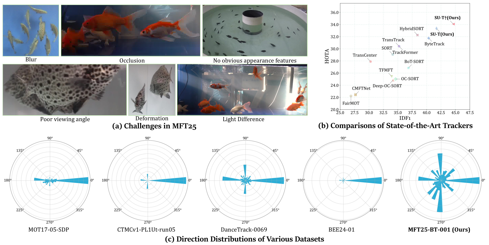

# Beyond Land-based MOT: A Benchmark and Framework for Underwater Multiple Fish Tracking

The official implementation of the paper：
>  [**Beyond Land-based MOT: A Benchmark and Framework for Underwater Multiple Fish Tracking**](##TODO:LINK##)  
>  Weiran Li, Yeqiang Liu, Qiannan Guo, Yijie Wei, Hwa Liang Leo, Zhenbo Li*
>  [**\[Paper\]**](##TODO:LINK##) [**\[Code\]**](https://github.com/vranlee/SU-T)

<div align="center">

</div>

Contact: vranlee@cau.edu.cn or weiranli@u.nus.edu. Any questions or discussion are welcome!

-----

## Updates
+ [2025.04] We have released the resources. The full datasets will be relasesd after the paper accepted.
-----

## Abstract
  Multiple object tracking (MOT) technology has made significant progress in terrestrial applications, but underwater tracking scenarios remain underexplored despite their importance to marine ecology and aquaculture. We present MFT25 (Multiple Fish Tracking Dataset 2025), the first comprehensive dataset specifically designed for underwater multiple fish tracking, featuring 15 diverse video sequences with 408,578 meticulously annotated bounding boxes across 48,066 frames. Our dataset captures various underwater environments, fish species, and challenging conditions including occlusions, similar appearances, and erratic motion patterns. Additionally, we introduce SU-T (Scale-aware and Unscented Tracker), a specialized tracking framework featuring an Unscented Kalman Filter optimized for non-linear fish swimming patterns and a novel FishIoU matching that accounts for the unique morphological characteristics of aquatic species. Extensive experiments demonstrate that our SU-T baseline achieves state-of-the-art performance on MFT25, with 34.1\% HOTA and 44.6\% IDF1, while revealing fundamental differences between fish tracking and terrestrial object tracking scenarios. MFT25 establishes a robust foundation for advancing research in underwater tracking systems with important applications in marine biology, aquaculture monitoring, and ecological conservation.

## Contributions

+ We introduce MFT25, the first comprehensive multiple fish tracking dataset featuring 15 diverse video sequences with 408,578 meticulously annotated bounding boxes across 48,066 frames, capturing various underwater environments, fish species, and challenging conditions including occlusions, rapid direction changes, and visually similar appearances.
    
+ We propose SU-T, a specialized tracking framework featuring an Unscented Kalman Filter optimized for non-linear fish swimming patterns and a novel FishIoU matching that accounts for the unique morphological characteristics and erratic movement behaviors of aquatic species.
    
+ We conduct extensive comparative experiments demonstrating that our SU-T baseline achieves state-of-the-art performance on MFT25, with 34.1\% HOTA and 44.6\% IDF1. Through quantitative analysis, we highlight the fundamental differences between fish tracking and terrestrial object tracking scenarios.

## Tracking Performance

### Comparisons on MFT25 dataset

| Method | Class | Year | HOTA↑ | MOTA↑ | IDF1↑ | DetA↑ | AssA↑ | IDs↓ | IDFP↓ | IDFN↓ | Frag↓ |
|--------|-------|------|-------|-------|-------|-------|-------|------|-------|-------|-------|
| FairMOT | JDE | 2021 | 22.226 | 47.509 | 26.867 | 35.606 | 13.910 | 939 | 58198 | 113393 | 3768 |
| CMFTNet | JDE | 2022 | 22.432 | 46.365 | 27.659 | 35.452 | 14.278 | 1301 | 64754 | 111263 | 2769 |
| TransTrack | TF | 2021 | 30.426 | 68.983 | 35.215 | _50.458_ | 18.525 | 1116 | 96045 | 93418 | 2588 |
| TransCenter | TF | 2023 | 27.896 | 68.693 | 30.278 | 30.301 | 30.255 | 807 | 101223 | 101002 | 1992 |
| TrackFormer | TF | 2022 | 30.361 | **74.609** | 35.285 | **52.649** | 17.661 | 718 | 89391 | 94720 | 1729 |
| TFMFT | TF | 2024 | 25.440 | 49.725 | 33.950 | 38.059 | 17.112 | 719 | 63125 | 102378 | 3251 |
| SORT | SDE | 2016 | 29.063 | 69.038 | 34.119 | 50.195 | 16.952 | 778 | 88928 | 96815 | _1726_ |
| ByteTrack | SDE | 2022 | 31.758 | _69.586_ | 40.355 | 49.712 | 20.392 | **489** | 80765 | 87866 | **1555** |
| BoT-SORT | SDE | 2022 | 26.848 | 49.108 | 36.847 | 37.241 | 19.446 | _500_ | 57581 | 99181 | 2704 |
| OC-SORT | SDE | 2023 | 25.017 | 46.706 | 34.620 | 35.369 | 17.783 | 550 | **52934** | 103495 | 3651 |
| Deep-OC-SORT | SDE | 2023 | 24.848 | 46.721 | 34.176 | 35.373 | 17.537 | 550 | _53478_ | 104024 | 3659 |
| HybridSORT | SDE | 2024 | 32.258 | 68.905 | 38.421 | 49.992 | 20.936 | 613 | 85924 | 90022 | 1931 |
| HybridSORT† | SDE | 2024 | 32.705 | 69.167 | _41.727_ | 49.697 | 21.701 | 562 | 79189 | 85830 | 1963 |
| **SU-T (Ours)** | SDE | 2025 | _33.351_ | 68.450 | 41.717 | 49.943 | _22.425_ | 607 | 83111 | _84814_ | 2006 |
| **SU-T† (Ours)** | SDE | 2025 | **34.067** | 68.958 | **44.643** | 49.531 | **23.594** | 544 | 76440 | **81304** | **1555** |

*Note:  † indicates the integration of ReID module, **Bold** indicates the best performance, _italics_ indicate the second-best performance

### Datasets
The MFT25 dataset have been released on [**\[BaiduYun: wrbg\]**](https://pan.baidu.com/s/11TkRqNIq4poNAU5dyoL5hA?pwd=wrbg).

## Pretrained Models
The pretrained models have been released on [**\[BaiduYun: 9uqc\]**](https://pan.baidu.com/s/1AkIuViwXCPz5l5Oo-UgtaQ?pwd=9uqc)

## Installation
+ **Step.1** Clone this repo.
+ **Step.2** Install dependencies.
   ```
   cd {Repo_ROOT}
   conda env create -f conda_env.yaml
   conda activate su_t
   ```
+ **Step.3** (Optional)
   Download the [pretrained models](https://pan.baidu.com/s/1AkIuViwXCPz5l5Oo-UgtaQ?pwd=9uqc) and [MFT25 dataset](https://pan.baidu.com/s/11TkRqNIq4poNAU5dyoL5hA?pwd=wrbg).
   ```
   - ROOT
      - pretrained
         - (Download Pretrained Models Here)
      - MFT25
         - (Download Datasets Here)
   ```

## Exps.

* Train
   ```
   python3 tools/train.py -f exps/SU-T(SU-T-ReID).py -d 8 -b 48 --fp16 -o -c pretrained/Checkpoint.pth.tar
   ```

* Test
   ```
   python tools/su_tracker.py -f exps/SU-T(SU-T-ReID).py -b 1 -d 1 --fp16 --fuse --expn your_bash_name
   ```

## Acknowledgement
A large part of the code is borrowed from [ByteTrack](https://github.com/ifzhang/ByteTrack), [OC_SORT](https://github.com/noahcao/OC_SORT), and [HybridSORT](https://github.com/ymzis69/HybridSORT). Thanks for their wonderful works!

## Citation
The citation format will be given after the manuscript is accepted. Using this repo citation if needed now.
